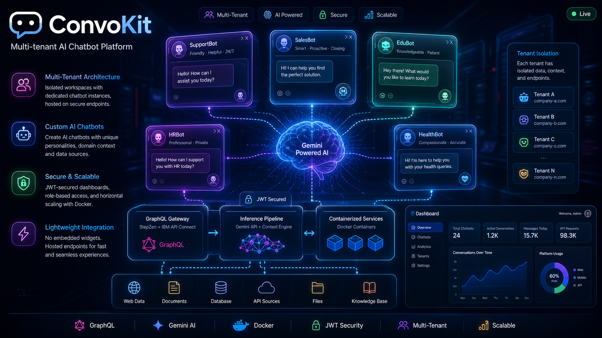
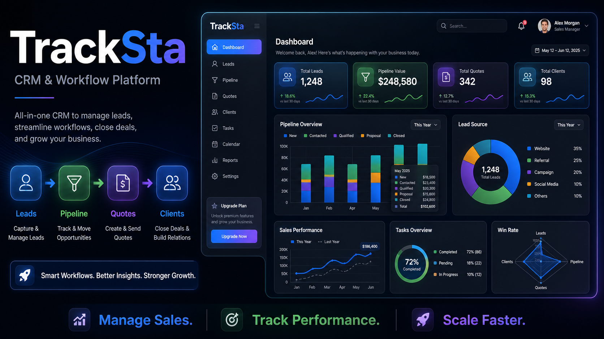
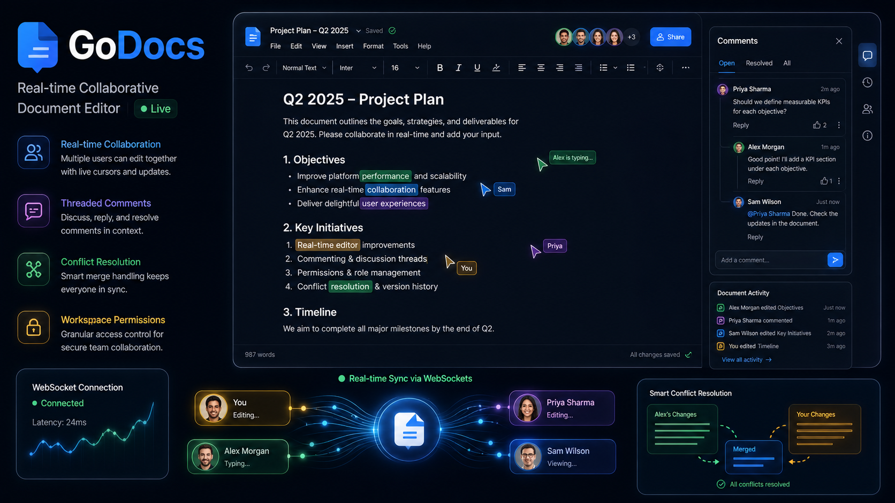

<h1 align="center">Hey 👋, I'm Aviral Singh</h1>

  🚀 Full Stack Developer | ⚡ Building Real Systems | 🧠 Always Learning

  
  
  

---

## 🧩 About Me

- 💼 Software Engineer with **startup experience**
- ⚡ Improved performance by **20%+ in production apps**
- 🧠 Love building **scalable & real-time systems**
- 🔁 Work across **frontend + backend + deployment**
- 📚 Currently exploring **DevOps & System Design**

---

## 🧱 My Tech Stack 

<table>
<tr>
<td align="center" width="50%">

### 💻 Frontend  

</td>

<td align="center" width="50%">

### ⚙️ Backend  

</td>
</tr>

<tr>
<td align="center" width="50%">

### 🗄️ Database  

</td>

<td align="center" width="50%">

### ⚡ DevOps / Tools  

</td>
</tr>
</table>

---

## 🚀 Projects

<table width="100%">
<tr>
<td width="33%" valign="top">

### 🧠 ConvoKit  
AI Chatbot Platform  

🔗 https://convo-kit-ai-agent-chatbot-ibm.vercel.app/

</td>

<td width="33%" valign="top">

### 📊 TrackSta  
CRM System  

🔗 https://crm-project-college-frontend.onrender.com/

</td>

<td width="33%" valign="top">

### 📝 GoDocs  
Realtime Docs Editor  

🔗 https://realtime-teams-docs-manager.vercel.app/sign-in

</td>
</tr>
</table>

---

## 📊 GitHub Stats

 

<table width="100%">
<tr>
<td width="50%" align="center">

</td>

<td width="50%" align="center">

</td>
</tr>
</table>

 

  

---

## 🧠 Currently Learning

- 🐳 Docker & Containerization  
- ⚙️ CI/CD Pipelines  
- 🧩 System Design  

---

## 🌐 Connect With Me

  
  
  

---

  ⚡ I build systems that are fast, scalable, and actually useful.

